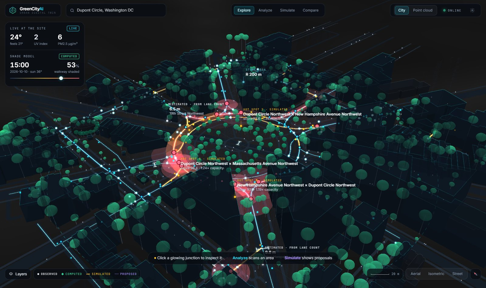
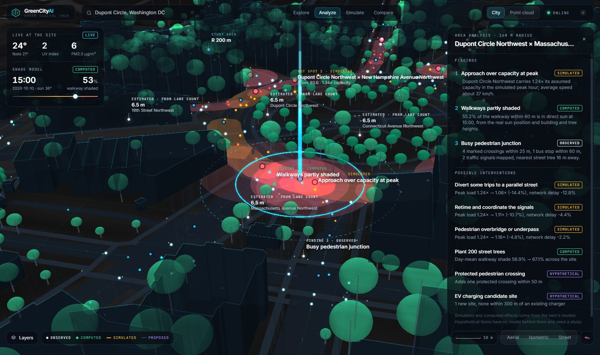
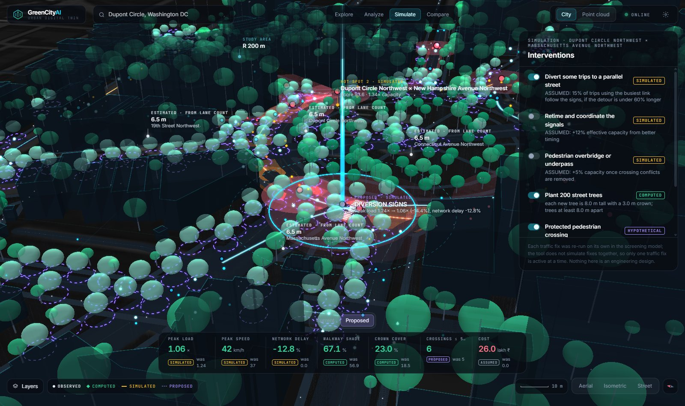
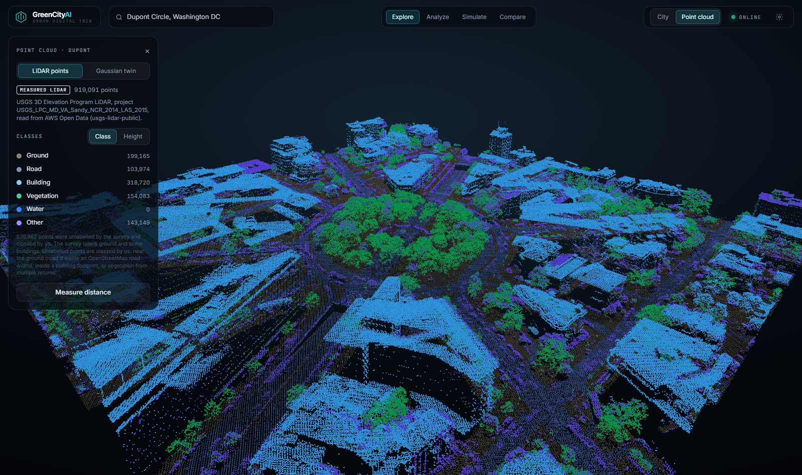
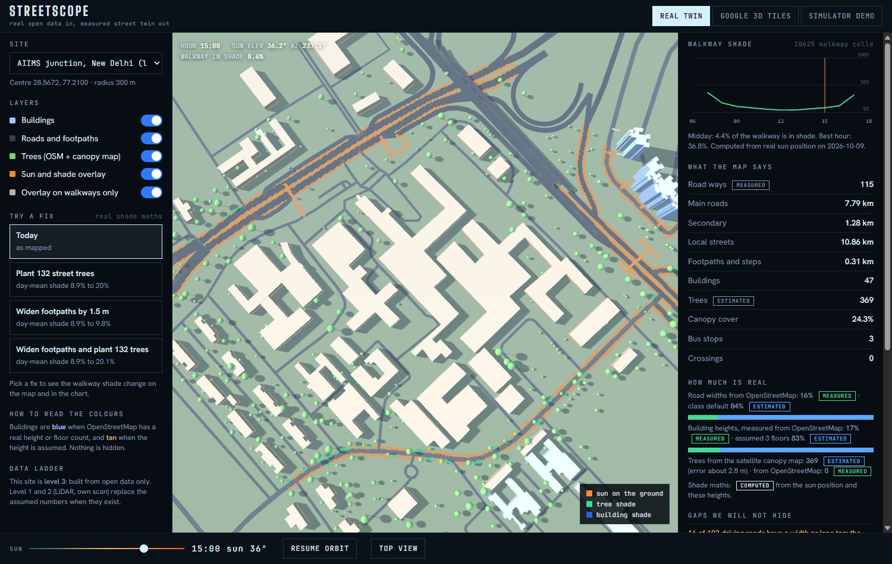
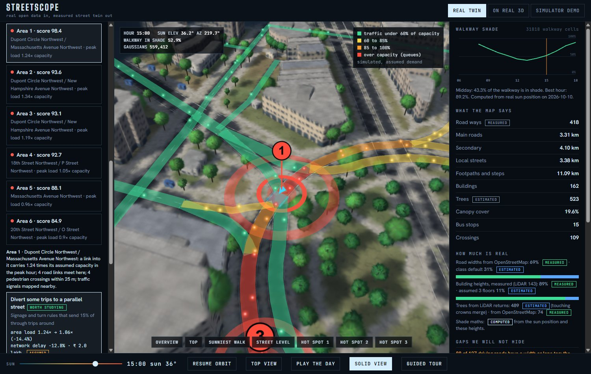
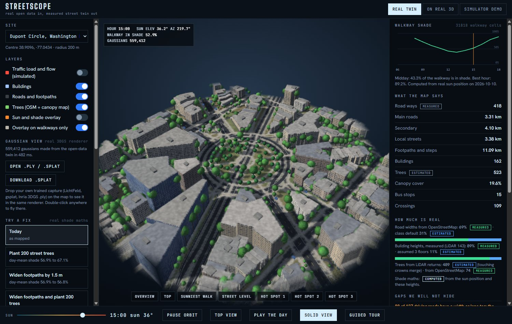
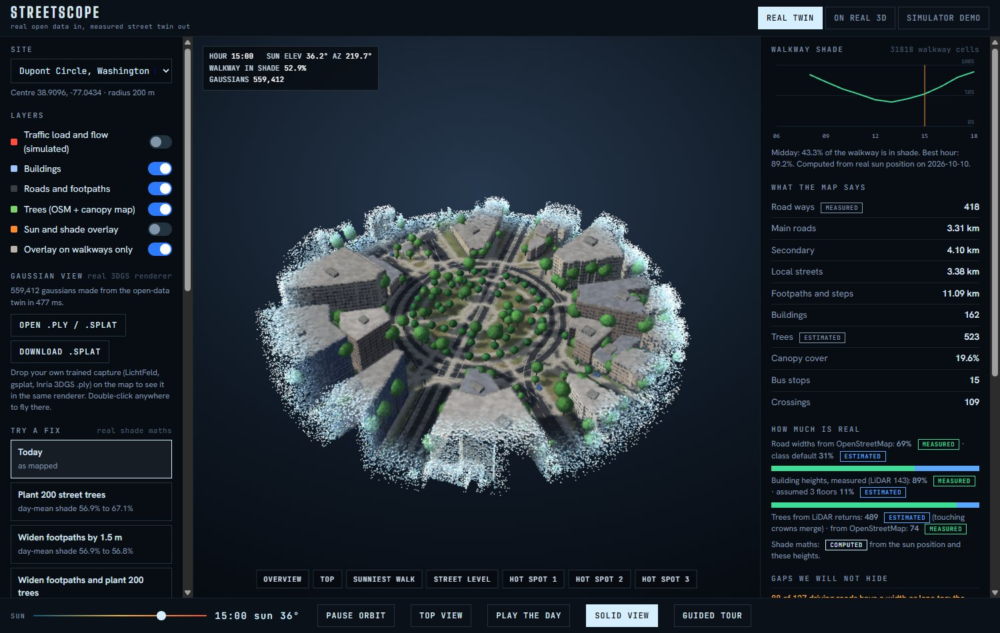
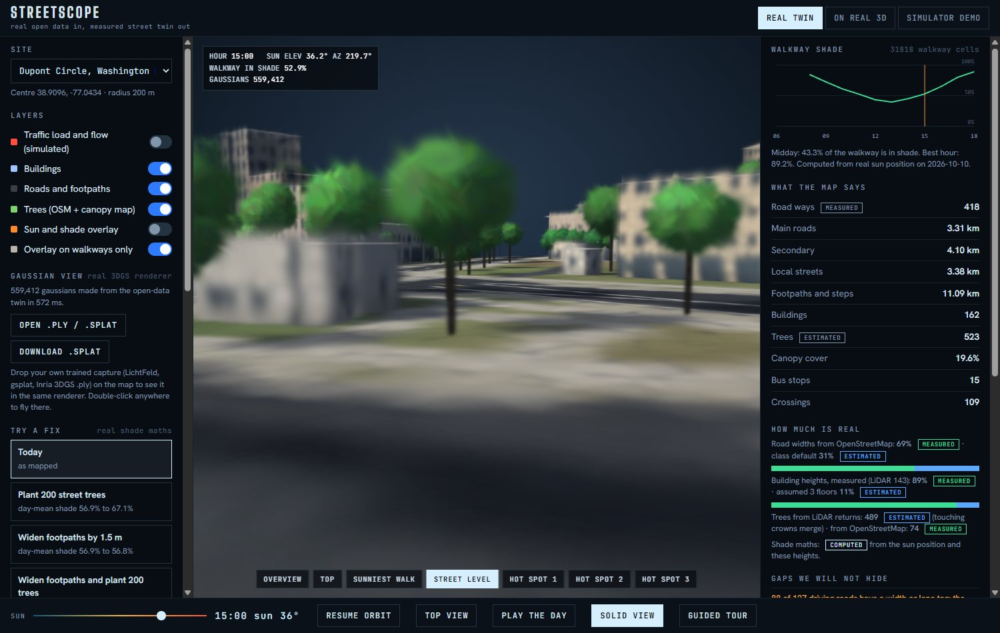
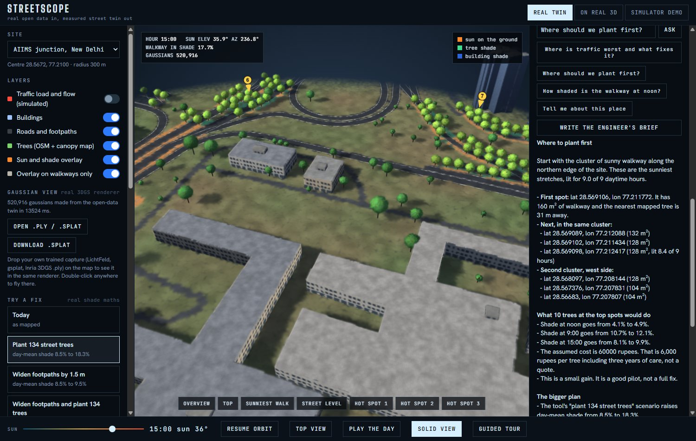

# Streetscope

**Open data in, measured street twin out.** Pick any junction. Streetscope builds a 3D twin from open data, computes where people walk in the sun, screens where traffic jams, tests fixes for both, and lets an AI "doctor" (Claude Sonnet 5.5) explain them. The twin is drawn as real 3D gaussian splats with a Luma-style reveal and smooth camera flights. The doctor can only quote numbers that its measuring tools returned, and a checker flags any number that did not come from a tool.

Built for the WeMakeDevs x AWS *Environmental Hacks* (Heat and Water track), October 2026.

## GreenCityAI: the 3D city app

`http://localhost:8765/app/` is **GreenCityAI**, a full-screen urban digital twin built on top of the Streetscope engine (React, TypeScript, Vite, Tailwind, CesiumJS, Three.js; source in `app/`).


*Explore: the city fills the screen. Traffic flows glow along the roads (simulated), hot spots pulse, road widths are drawn as dimension lines, and live weather and air quality from Open-Meteo sit beside the computed shade.*

| Mode | What happens |
|---|---|
| **Explore** | Orbit, pan, zoom. Hover and click junctions, roads, buildings, trees, bus stops and chargers. A click flies the camera in, tilts it, highlights the object and opens a slim panel: key numbers, data source, detected issues and a recommended action. |
| **Analyze** | *Analyze Area* sweeps a scan across the junction, lights up roads, trees, stops and crossings in turn, then pins three findings to their places on the map. Each finding and intervention says whether it is observed, computed, simulated or hypothetical. *Explain with Claude* asks the doctor through your Claude Code login. |
| **Simulate** | Before / Proposed. The proposals appear in a wave from the junction: a diversion route with travel times, signal control, a bus lane, an overbridge, street trees, a protected crossing, EV charger candidates. A strip compares peak load, peak speed, network delay, walkway shade, crown cover, crossings and assumed cost. |
| **Compare** | Every intervention on one chart: simulated effect against assumed cost. Click one to preview it in 3D. |
| **Point cloud** | Real USGS LiDAR (919,091 points at Dupont Circle, 403,857 at Times Square), coloured by class or height, with class toggles, point picking and a distance tool. Sites without LiDAR show the gaussian twin, labelled as generated. |





**Google Earth 3D:** open *Settings* (the gear), paste a Google Maps key with the Map Tiles API enabled, or a free Cesium ion token. The analysis then sits on Google Photorealistic 3D Tiles; overlay heights are sampled from the tiles so they sit on the real streets. A key saved in `earth.html` on the same server is reused. Without a key the app draws the city from open data on a dark Esri basemap, so it always works. The Google tiles are only displayed: every number comes from OpenStreetMap, LiDAR and the twin's own models, never from the tiles (measuring the tiles would break Google's terms).

Rebuild the app after changing `app/src`: `cd app`, `npm install`, `npm run build` (writes `web/app`). Export LiDAR points for a US site: `set PYTHONPATH=pipeline` then `python -m streetscope.points --site web/data/dupont`.

## See it in 60 seconds

Run `scripts/run_all.bat` (or the commands under *Run it*), then open these links:

| Link | What you see |
|---|---|
| `http://localhost:8765/app/?site=dupont` | **GreenCityAI**: the 3D city app (Explore, Analyze, Simulate, Compare, Point cloud) |
| `http://localhost:8765/` | Landing page with live headline numbers |
| `viewer.html?site=dupont` | Dupont Circle as about 560,000 gaussian splats: watch the reveal, then use the fly-to buttons or double-click anywhere |
| `viewer.html?site=aiims&fix=trees&view=top&overlay=1` | AIIMS junction with 134 planted street trees (lime green) and the sun and shade colours |
| `viewer.html?site=dupont&area=1` | Traffic hot spot 1 at Dupont Circle, its reasons and three tested fixes |
| `viewer.html?site=aiims&tour=1` | A 45-second guided tour: twin, shade, traffic, fix, street level, doctor |
| `viewer.html?site=aiims&splat=0` | The solid analysis view (meshes instead of splats) |
| `viewer.html?site=dupont&brief=1` | The doctor writes an engineer's brief from its tools |
| `earth.html?site=dupont&area=1` | The same traffic analysis on real 3D (CesiumJS) |


*Today: orange walkway is in direct sun at 15:00. Only 8.1% is shaded.*


*Traffic hot spot 1 at Dupont Circle. Dots crawl where the simulated load passes capacity. Diverting 15% of through trips drops the area load from 1.24 to 1.06 times capacity in the model.*


*Gaussian view: Dupont Circle as 559,412 gaussians, lit by the real sun at 15:00. Real 3DGS rendering; the gaussians are made from open map data, not trained from photos.*


*Loading: splats rise as small glowing particles in a wave from the centre, then settle and grow to full size.*


*"Street level": the camera glides down to eye height on the sunniest walkway.*


*Plant 134 street trees: day-mean walkway shade 8.5% to 18.3%. The answer is from Claude Sonnet 5.5 through Claude Code, with no API key. The checker marks any number Claude worked out itself instead of copying it from a tool.*

Docs: [writeup](docs/WRITEUP.md), [3-minute video script](docs/VIDEO_SCRIPT.md), [demo and submission checklist](docs/DEMO_CHECKLIST.md).

## The problem

Cities plan streets from flat maps and old drawings. Heat is 3D: shade depends on building height, tree crowns and the sun's angle. A junction can look fine on a map and still leave walkers in direct sun for ten hours a day. The same junction is often where traffic queues. The 3D data that could show both exists, but it sits in expert tools.

## What it does

| Part | What it gives you |
|---|---|
| **Twin Builder** (`pipeline/`) | OpenStreetMap in, twin out: roads with width and the *source* of that width, buildings with the source of their height, trees, bus stops, crossings, traffic signals. Then a real sun position and a numpy shade engine give hourly shade on every walkway cell. |
| **Real-data viewer** (`web/viewer.html`) | Renders the twin in 3D with a sun slider, shade overlay, and a "how much is real" panel. Assumed values are coloured differently and listed under "gaps we will not hide". *Play the day* animates the sun. |
| **Try a fix** (`pipeline/streetscope/scenarios.py`, viewer) | Three what-if fixes with real shade maths: plant street trees on the sunniest walkway spots (about one per 80 m² of walkway, 8 m apart), widen footpaths by 1.5 m, or both. Shows day-mean walkway shade and shaded walking area before and after, and an assumed cost. At AIIMS, 134 trees move day-mean walkway shade from 8.5% to 18.3%. |
| **Traffic screen** (`pipeline/streetscope/traffic.py`, viewer, real 3D) | Splits the road network at junctions, makes peak-hour trips from building floor area plus through traffic, and routes them with a congestion-aware assignment (BPR curve). It ranks junction areas by load and conflicts (links meeting, crossings, bus stops, signals), then re-runs the model for each candidate fix: bus lane, signal timing, foot overbridge, route diversion, extra lane. On screen: roads coloured by load, moving dots that slow down past capacity, pulsing numbered hot spots, fix cards with before and after, and a 3D preview of each fix. |
| **Gaussian view** (`web/gs.js`, default in the viewer) | A real 3D Gaussian Splatting renderer written for this project (WebGL2, no libraries): anisotropic gaussians projected with the EWA Jacobian, depth-sorted in a worker every time the camera moves, blended back to front. The twin becomes about 400,000 to 600,000 gaussians: ground discs, road markings and zebra stripes, facades with floors, windows and shopfronts, roofs with plant rooms, leaf-like gaussians in each tree crown. Ground shadows come from the shade engine for the chosen hour. Loading plays a Luma-style reveal; fly-to buttons and double-click give smooth arcing camera flights. You can open your own trained capture (3DGS `.ply` from LichtFeld, gsplat or Inria, or `.splat`); it is turned the right way up automatically. *Download .splat* exports the scene for SuperSplat and other viewers. |
| **Doctor** (`agent/`) | Claude Sonnet 5.5 with eleven allow-listed tools, including `traffic_areas` and `propose_solutions`. Locally it runs through the Claude Code command line with your own login, so no API key is needed: the tools reach Claude through a small MCP server (`mcp_server.py`) and Claude gets no file, shell or web access. It can also use the Anthropic API, or Amazon Bedrock when deployed. A number checker verifies every figure in each answer. It can also write a three-part engineer's brief. Without a key it falls back to labelled offline templates over the same tools, and the badge in the page says which one answered. |
| **On real 3D** (`web/earth.html`, CesiumJS) | The same analysis on photoreal Google 3D Tiles: shade overlay draped on the real streets, roads, trees, planned trees that grow, measured building outlines, the traffic screen with glowing load-coloured roads and fix previews, the doctor with fly-to pins, camera presets (overview, top-down, orbit, street walk), bloom glow, and a guided tour. Google tiles are display only. Without a key it runs on a flat OpenStreetMap map. |
| **Simulator demo** (`web/demo/`) | A generated junction with a car-following traffic simulator, signals, bus lanes, six fixes and before/after. Clearly labelled as generated. |

## Honest limits

- Level of data: the three Delhi and Tokyo sites are level 3 (open data only). The two US sites are level 1: building heights come from USGS airborne LiDAR. An own phone scan (level 2) is planned.
- OpenStreetMap often lacks widths and heights. The viewer shows the percentages, for example 23% of road widths and 17% of building heights are real at the AIIMS site.
- Trees come from OpenStreetMap plus the Meta and WRI 1 m canopy height map (AWS Open Data). At AIIMS that is 369 tree tops and 24% cover where OpenStreetMap mapped none. The map's average error is 2.8 m and touching crowns merge, so counts are a lower bound. Dense Shibuya shows only 8 canopy tops, which is true to a concrete district.
- Planted-tree results assume an 8 m tree with a 3 m crown. Costs use assumed unit rates (6,000 rupees per tree, 3,500 per m² of footpath) and are not quotes. Widening a footpath adds walking space but barely changes the shade percentage, and the page shows that rather than hiding it.
- **The traffic screen is simulated.** No traffic counts are used. Demand comes from building floor area, is scaled so the busiest links sit near capacity, and lane capacities are assumed. Read the ranking and the relative change of each fix, not the vehicle numbers. Every fix states its assumption (for example "15% of trips follow the diversion signs") and its cost is an assumed unit rate.
- The gaussian view uses a real 3DGS renderer, but the twin's gaussians are generated from open map data, not trained from photos, so facades and roofs are typical rather than true to life. A photo-real twin needs a phone or drone scan (level 2); such a capture can be opened in the same viewer.
- LiDAR trees: the two surveys used here carry no vegetation labels, so trees are found from multiple-return pulses. Touching crowns merge and a few shrubs or scaffolds can slip in; the viewer says so. At Times Square 91 of 102 building heights are measured and 77 tree tops are found (1.7% cover); Dupont Circle has 489 (19.6%).
- The simulator demo is not a calibrated traffic model. Its bus-lane result assumes 40% of car trips move to buses.
- The Claude Code path was tested live on this machine (traffic question and engineer's brief, every number verified). The Anthropic API and Bedrock paths are tested only with a stand-in client.

## Run it

```bash
python -m pip install numpy pytest rasterio "laspy[lazrs]" pyproj "anthropic[bedrock]" strands-agents boto3
python scripts/serve.py            # http://localhost:8765/  (landing page, viewer.html, earth.html, demo/)
python scripts/dev_api.py          # http://localhost:8766/ask  (the doctor) and /status (which model answers)
```

Windows: double-click `scripts/run_all.bat` (starts both servers and opens the landing page).

The doctor picks its model like this:

| You set | Who answers |
|---|---|
| nothing, with Claude Code installed and logged in (`claude` on the PATH) | Claude Sonnet 5.5 through Claude Code, using your login. No API key. |
| `ANTHROPIC_API_KEY` in your own terminal | Claude Sonnet 5.5 through the Anthropic API |
| `LLM_BACKEND=bedrock` plus `aws configure` | Claude Sonnet 5.5 on Amazon Bedrock (`anthropic.claude-sonnet-5-5`) |
| `LLM_BACKEND=strands` | The older Strands agent on Bedrock (`BEDROCK_MODEL_ID`) |
| `USE_LLM=0`, or no Claude Code and no key | Offline templates over the same tools, clearly labelled |

Build a new site (needs internet for the Overpass download):

```bash
set PYTHONPATH=pipeline
python -m streetscope build --lat 28.5672 --lon 77.2100 --radius 300 --name aiims --out web/data
```

Inside the US the builder reads USGS LiDAR automatically (`--lidar off` to skip); elsewhere it reads the canopy map (`--no-canopy` to skip). Both are cached in the site folder. Add the site to `web/data/index.json` to see it in the viewer. Use `--tz` for the site's UTC offset and `--date` for the day to model. `python scripts/rebuild_sites.py --cached` rebuilds all five sample sites from their saved downloads.

Tests (65):

```bash
set PYTHONPATH=pipeline;agent
python -m pytest pipeline/tests agent/tests
```

### Real 3D page

`earth.html` shows photoreal tiles when you give it a key. Enable **Map Tiles API** in Google Cloud, create an API key restricted to that API and to `http://localhost:8765/*`, set a budget alert, then paste it into the page. The key stays in your browser. Without a Google billing account you can paste a free Cesium ion token instead.

## Deploy to AWS

```bash
python scripts/package_lambda.py
cd infra
sam build && sam deploy --guided      # asks for ClaudeModelId and AskToken
```

Creates an S3 bucket behind CloudFront for the web files and a Lambda (Function URL) running the doctor with Claude Sonnet 5.5 on Amazon Bedrock. Turn on model access for Claude Sonnet 5.5 in the Bedrock console first. Then sync `web/` to the bucket and set `web/config.js` to the printed `AskUrl` and your token. The template is checked with cfn-lint but has not been deployed from this repo yet.

## Architecture

```
OpenStreetMap (Overpass) --> Twin Builder (numpy) --> twin.json + shade.bin + walk.bin
canopy map / USGS LiDAR -->        |  shade engine, scenarios, traffic screen
                                   |
                  web/viewer.html, web/earth.html      agent tools (deterministic)
                                                                |
                                     Claude Sonnet 5.5 (Anthropic API or Amazon Bedrock)
                                                                |
                                      number checker: every figure traced to a tool
```

## Data and licences

- Map data: (c) OpenStreetMap contributors, ODbL. Downloads use the Overpass API.
- Sun position: NOAA general solar position formulas.
- 3D rendering: three.js (MIT) and CesiumJS (Apache 2.0). Google Photorealistic 3D Tiles are display only under Google's terms: no geodata extraction, no object detection on the tiles.
- Fonts: Big Shoulders Display, Hanken Grotesk, Inter, JetBrains Mono (SIL OFL) via Google Fonts.
- GreenCityAI basemap: Esri World Dark Gray Canvas. Live weather and air quality: Open-Meteo (CC BY 4.0). Place search: OpenStreetMap Nominatim.
- Trees: Meta and WRI canopy height map, CC BY 4.0, read from AWS Open Data with rasterio.
- Heights: USGS 3D Elevation Program LiDAR, public domain, read from the AWS Open Data bucket `usgs-lidar-public` (Entwine Point Tiles). The pipeline finds the survey that covers a point, downloads only the octree nodes inside a 340 m window, and caches 1 m rasters as `lidar.npz`.
- Traffic model: the BPR volume-delay curve (US Bureau of Public Roads, 1964), applied with our own assumed capacities.

## Rules check

- New work only: this repository's history starts on 9 October 2026, during the event.
- AWS: Claude Sonnet 5.5 on Amazon Bedrock powers the deployed doctor; CloudFront, S3 and Lambda host it; LiDAR and the canopy map come from AWS Open Data.
- Libraries and public APIs are credited above.

## AI tools used

In the product: Claude Sonnet 5.5 (Anthropic), through Claude Code on a local machine, the Anthropic Python SDK, or Amazon Bedrock when deployed. An optional older path uses the Strands Agents SDK on Bedrock. The model cannot read data directly and its answers are number-checked.

While building: add your own honest list here before submitting, as the hackathon asks.

## Layout

```
app/        GreenCityAI: React + TypeScript + Cesium app (builds into web/app)
pipeline/   Twin Builder: geo, osm, twin, shade, canopy, lidar, points, scenarios, traffic, cli + tests
agent/      Claude doctor (Claude Code, API or Bedrock), MCP tool server, tools, number verifier, Lambda handler + tests
web/        viewer, gaussian splat renderer (gs.js), real 3D page, simulator demo, sample twins (data/)
infra/      AWS SAM template
scripts/    serve, dev API, site rebuild, Lambda packaging
```

## Licence

MIT. See `LICENSE`.
