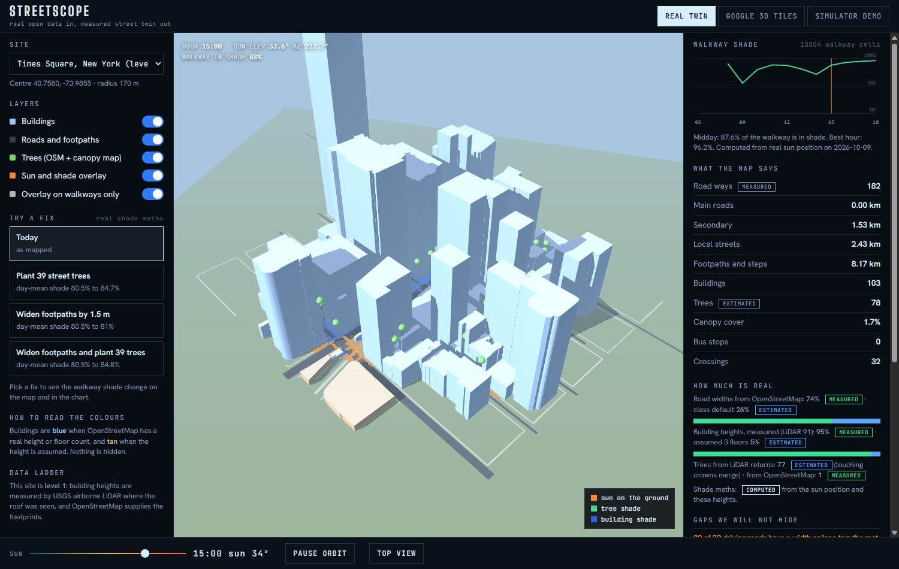

# Streetscope

**Open data in, measured street twin out.** Pick any junction. Streetscope builds a 3D twin from open data, computes where people walk in the sun, simulates traffic and signals, and lets an AI "doctor" propose fixes. The doctor can only quote numbers that its measuring tools returned, and a checker flags any number that did not come from a tool.

Built for the WeMakeDevs x AWS *Environmental Hacks* (Heat and Water track), October 2026.

## See it in 60 seconds

Run `scripts/run_all.bat` (or the commands under *Run it*), then open these links:

| Link | What you see |
|---|---|
| `http://localhost:8765/` | Landing page with live headline numbers |
| `viewer.html?site=aiims&fix=trees&view=top` | AIIMS junction with 132 planted street trees (yellow) |
| `viewer.html?site=times` | Times Square, level 1: building heights measured by LiDAR |
| `viewer.html?site=aiims&view=top&ask=Where%20should%20we%20plant%20first%3F` | The doctor answering, with its number check |


*Today: orange walkway is in direct sun at 15:00. Only 8.6% is shaded.*


*Plant 132 street trees: day-mean walkway shade 8.9% to 20%. The doctor's answer is checked against its tools.*


*Level 1: 91 of 103 building heights at Times Square are measured by USGS LiDAR.*

Docs: [writeup](docs/WRITEUP.md), [3-minute video script](docs/VIDEO_SCRIPT.md), [demo and submission checklist](docs/DEMO_CHECKLIST.md).

## The problem

Cities plan streets from flat maps and old drawings. Heat is 3D: shade depends on building height, tree crowns and the sun's angle. A junction can look fine on a map and still leave walkers in direct sun for ten hours a day. The 3D data that could show this exists, but it sits in expert tools.

## What it does

| Part | What it gives you |
|---|---|
| **Twin Builder** (`pipeline/`) | OpenStreetMap in, twin out: roads with width and the *source* of that width, buildings with the source of their height, trees, bus stops, crossings. Then a real sun position and a numpy shade engine give hourly shade on every walkway cell. |
| **Real-data viewer** (`web/viewer.html`) | Renders the twin in 3D with a sun slider, shade overlay, and a "how much is real" panel. Assumed values are coloured differently and listed under "gaps we will not hide". |
| **Try a fix** (`pipeline/streetscope/scenarios.py`, viewer) | Three what-if fixes with real shade maths: plant street trees on the sunniest walkway spots (about one per 80 m² of walkway, 8 m apart), widen footpaths by 1.5 m, or both. Shows day-mean walkway shade and shaded walking area before and after, and an assumed cost. At AIIMS, 132 trees move day-mean walkway shade from 8.9% to 20%. |
| **Doctor** (`agent/`) | A Strands agent on Amazon Bedrock with nine allow-listed tools, including `list_scenarios`. A number checker verifies every figure in each answer. Falls back to a labelled offline answer if Bedrock is not reachable. |
| **On real 3D** (`web/earth.html`, CesiumJS) | The same analysis on photoreal Google 3D Tiles: shade overlay draped on the real streets, roads by class with measured widths, trees, planned trees that grow, measured building outlines, simulated traffic, the doctor with fly-to pins, camera presets (overview, top-down, orbit, street walk) and a guided tour. Google tiles are display only. Without a key it runs on a flat OpenStreetMap map. |
| **Simulator demo** (`web/demo/`) | A generated junction with a car-following traffic simulator, signals, bus lanes, six fixes and before/after. Clearly labelled as generated. |

## Honest limits

- Level of data: the three Delhi and Tokyo sites are level 3 (open data only). The two US sites are level 1: building heights come from USGS airborne LiDAR. An own phone scan (level 2) is planned.
- OpenStreetMap often lacks widths and heights. The viewer shows the percentages, for example 17% of building heights are real at the AIIMS site.
- Trees come from OpenStreetMap plus the Meta and WRI 1 m canopy height map (AWS Open Data). At AIIMS that is 369 tree tops and 24% cover where OpenStreetMap mapped none. The map's average error is 2.8 m and touching crowns merge, so counts are a lower bound. Dense Shibuya shows only 8 canopy tops, which is true to a concrete district.
- Planted-tree results assume an 8 m tree with a 3 m crown. Costs use assumed unit rates (6,000 rupees per tree, 3,500 per m² of footpath) and are not quotes. Widening a footpath adds walking space but barely changes the shade percentage, and the page shows that rather than hiding it.
- LiDAR trees: the two surveys used here carry no vegetation labels, so trees are found from multiple-return pulses. Touching crowns merge and a few shrubs or scaffolds can slip in; the viewer says so. At Times Square 91 of 103 building heights are measured and 77 tree tops are found (1.7% cover); Dupont Circle has 489 (19.6%).
- The simulator demo is not a calibrated traffic model. Its bus-lane result assumes 40% of car trips move to buses.

## Run it

```bash
python -m pip install numpy pytest rasterio "laspy[lazrs]" pyproj strands-agents boto3
python scripts/serve.py            # http://localhost:8765/  (landing page, viewer.html, earth.html, demo/)
python scripts/dev_api.py          # http://localhost:8766/ask  (the doctor; add USE_LLM=0 for offline only)
```

Windows: double-click `scripts/run_all.bat` (starts both servers and opens the landing page).

Build a new site (needs internet for the Overpass download):

```bash
set PYTHONPATH=pipeline
python -m streetscope build --lat 28.5672 --lon 77.2100 --radius 300 --name aiims --out web/data
```

Inside the US the builder reads USGS LiDAR automatically (`--lidar off` to skip); elsewhere it reads the canopy map (`--no-canopy` to skip). Both are cached in the site folder. Add the site to `web/data/index.json` to see it in the viewer. Use `--tz` for the site's UTC offset and `--date` for the day to model.

Tests (39):

```bash
set PYTHONPATH=pipeline;agent
python -m pytest pipeline/tests agent/tests
```

### Real 3D page

`earth.html` shows photoreal tiles when you give it a key. Enable **Map Tiles API** in Google Cloud, create an API key restricted to that API and to `http://localhost:8765/*`, set a budget alert, then paste it into the page. The key stays in your browser. Without a Google billing account you can paste a free Cesium ion token instead.

## Deploy to AWS

```bash
python scripts/package_lambda.py
cd infra
sam build && sam deploy --guided      # asks for BedrockModelId and AskToken
```

Creates an S3 bucket behind CloudFront for the web files and a Lambda (Function URL) running the doctor with Bedrock access. Then sync `web/` to the bucket and set `web/config.js` to the printed `AskUrl` and your token. The template is checked with cfn-lint but has not been deployed from this repo yet.

## Architecture

```
OpenStreetMap (Overpass) --> Twin Builder (numpy) --> twin.json + shade.bin + walk.bin
                                                         |                |
                                              web/viewer.html     agent tools (deterministic)
                                                                          |
                                                      Strands agent on Amazon Bedrock
                                                                          |
                                                    number checker: every figure traced to a tool
```

## Data and licences

- Map data: (c) OpenStreetMap contributors, ODbL. Downloads use the Overpass API.
- Sun position: NOAA general solar position formulas.
- 3D rendering: three.js (MIT) and CesiumJS (Apache 2.0). Google Photorealistic 3D Tiles are display only under Google's terms: no geodata extraction, no object detection on the tiles.
- Fonts: Big Shoulders Display, Hanken Grotesk, JetBrains Mono (SIL OFL) via Google Fonts.
- Trees: Meta and WRI canopy height map, CC BY 4.0, read from AWS Open Data with rasterio.
- Heights: USGS 3D Elevation Program LiDAR, public domain, read from the AWS Open Data bucket `usgs-lidar-public` (Entwine Point Tiles). The pipeline finds the survey that covers a point, downloads only the octree nodes inside a 340 m window, and caches 1 m rasters as `lidar.npz`.

## Rules check

- New work only: this repository's history starts on 9 October 2026, during the event.
- AWS: Amazon Bedrock and Strands Agents (open source) power the doctor; CloudFront, S3 and Lambda host it.
- Libraries and public APIs are credited above.

## AI tools used

In the product: Amazon Bedrock (Amazon Nova) through the Strands Agents SDK. The agent cannot read data directly and its answers are number-checked.

While building: add your own honest list here before submitting, as the hackathon asks.

## Layout

```
pipeline/   Twin Builder: geo, osm, twin, shade, cli + tests
agent/      Strands agent, tools, number verifier, Lambda handler + tests
web/        viewer, Google 3D Tiles page, simulator demo, sample twins (data/)
infra/      AWS SAM template
scripts/    serve, dev API, Lambda packaging
```

## Licence

MIT. See `LICENSE`.
